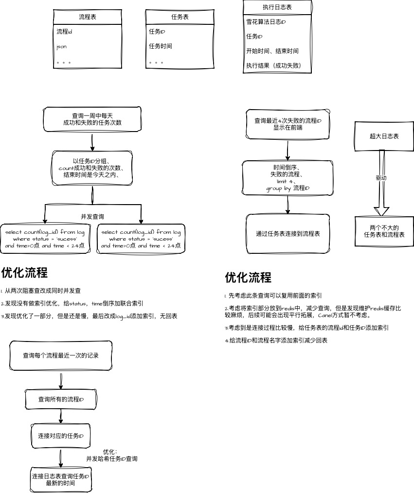

# 定位解决慢 SQL 问题

## 发现问题

上级在检查系统运行时，发现有一个接口响应时间超过了预期，需要等待 19 秒才能返回结果，亟待优化，十分影响系统体验，特别是该查询是首页，每次加载都需要等待 19 秒，十分影响用户体验。

## 定位问题

### 开启慢查询日志

- 查看是否开启了慢查询日志

```sql
SHOW VARIABLES LIKE 'slow_query_log';
```

- 开启慢查询日志

```sql
SET GLOBAL slow_query_log = 1;
```

- 查看慢查询日志文件路径

```sql
SHOW VARIABLES LIKE 'slow_query_log_file';
```

### 收集慢 SQL

- 等待系统运行一段时间，确保有足够的慢查询记录

- 查找所有慢日志中执行时间超过 5 秒的查询，并且包含表名

```sql
SELECT * FROM mysql.slow_log WHERE time > 5 AND LOWER(LEFT(sql_text, 100)) NOT LIKE '%show%';
```

### 分析执行计划

- 查看慢查询的执行计划

```sql
EXPLAIN SELECT * FROM table_name WHERE condition;
```

- 分析执行计划，查看是否使用了索引，是否全表扫描

- 如果没有使用索引，考虑添加索引

- 如果全表扫描，考虑优化查询语句，添加合适的索引

- 如果索引使用不当，考虑调整索引策略

- 如果是因为多表连接，考虑添加合适的索引，或者优化查询语句，避免全表扫描

### 定位瓶颈（索引/写法/数据量）

### 优化



### 验证

- 等待系统运行一段时间，确保优化生效

- 检查慢查询日志，查看是否有优化后的查询记录

- 检查接口响应时间，是否符合预期

### 建立监控

- 编写定时脚本，定时检查慢查询日志，记录异常查询

- 配置监控报警，当异常查询数量超过阈值时，触发报警，发送报警邮件到 DBA
