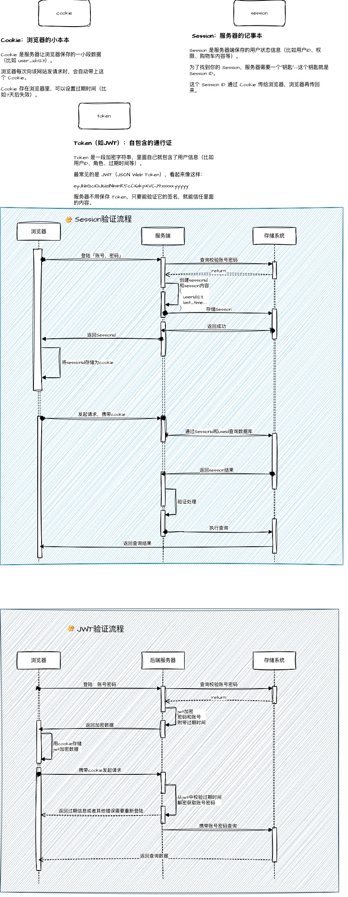

# cookie 是什么

## 定义

- cookie 是一种存储在用户浏览器中的小型文本文件，用于在客户端和服务器之间传递信息。
- 它包含了一些键值对，用于存储用户的状态信息，例如登录状态、购物车内容等。
- 每个 cookie 都有一个过期时间，超过这个时间，cookie 就会被删除。
- cookie 是一种明文存储，容易被窃取，因此不建议存储敏感信息，例如密码等。

总结：cookie 就是一个存储在浏览器的明文文件，每次向服务器发送请求时，都会携带这个文件，服务器可以根据这个文件来判断用户的状态。

# session 是什么

## 定义

- session 是一种存储在服务器端的会话状态机制，用于在多个请求之间保持用户的状态。
- 每个 session 都有一个唯一的 session ID，用于标识不同的用户会话。
- session 可以存储用户的登录状态、购物车内容等信息。
- session 通常会在用户登录后创建，用户退出登录后销毁。

总结：session 就是一个存储在服务器端的文件，每次向服务器发送请求时，都会携带 session ID，服务器可以根据 session ID 来判断用户的状态。

# jwt 是什么

## 定义

- jwt 是一种基于 JSON 的开放标准（RFC 7519），用于在各方之间安全地传输信息。
- 它通常用于身份验证和授权场景，例如用户登录后，服务器会生成一个 jwt 令牌，并将其返回给客户端。
- jwt 令牌包含了用户的身份信息和一些权限声明，客户端在后续请求中携带这个令牌，服务器可以根据令牌来验证用户的身份和权限。

总结：jwt 就是一个存储在客户端的文件，每次向服务器发送请求时，都会携带这个文件，服务器可以根据这个文件来判断用户的身份和权限。

# 三者在前后端交互的流程

