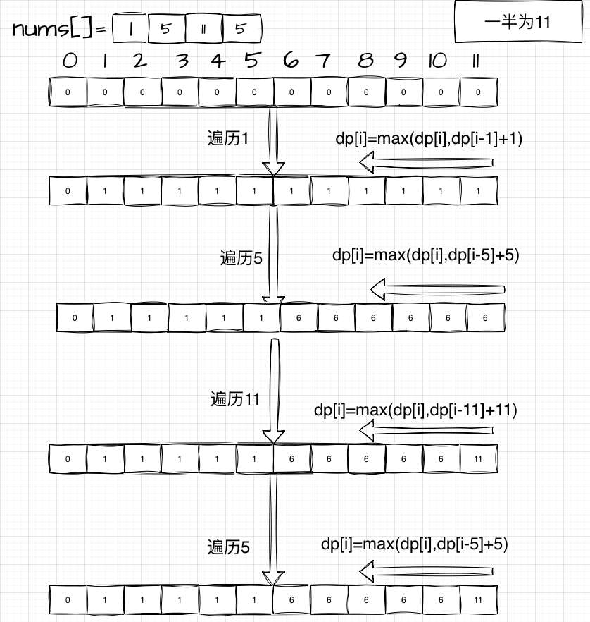

# 01 背包问题通用模板

模板适用条件：一个物品数组，例如`int[] nums`，每个物品只能拿一次。需要知道在小于等于物品重量下的最大价值。

[分割等和子集](https://leetcode.cn/problems/partition-equal-subset-sum/)
[最后一块石头重量](https://leetcode.cn/problems/last-stone-weight-ii/)
...待补充

这两题的规律都是，需要你找出在特定重量下的最大价值。只是这个时候重量和价值是一样的。

下面是通用模板图例：


下面是通用模板代码：

```java
public int knapsack(int[] nums, int W) {
    int n = nums.length;
    int[] dp = new int[W + 1];
    for (int i = 1; i <= n; i++) {
        int w = nums[i - 1];
        for (int j = W; j >= w; j--) {//从大到小遍历，避免重复计算，注意j>=w
            dp[j] = Math.max(dp[j], dp[j - w] + w);//dp[j - w] + w表示在重量为j - w下的最大价值加上当前物品的重量w
        }
    }
    return dp[W];//dp[W]表示在重量为W下的最大价值
}
```

